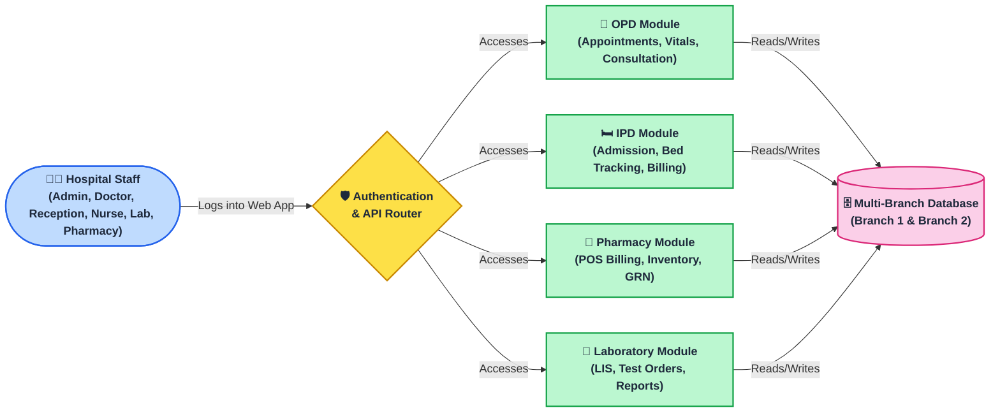
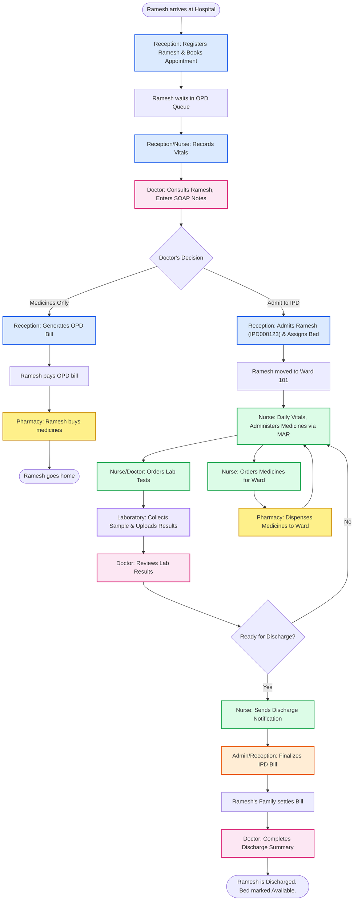

# GM_HMS — Hospital Management System
## Project Overview & Executive Summary

---

> **Document Type:** Executive Overview  
> **Version:** 2.0.0  
> **Prepared For:** Chairman · COO · Director · Manager  
> **Prepared By:** GM HMS Development Team  
> **Date:** August 2026  
> **Classification:** Internal — Confidential

---

## Table of Contents
1. [Executive Summary](#1-executive-summary)
2. [Project Objectives](#2-project-objectives)
3. [System Scope](#3-system-scope)
4. [Technology Stack](#4-technology-stack)
5. [User Roles & Access Matrix](#5-user-roles--access-matrix)
6. [Key Features at a Glance](#6-key-features-at-a-glance)
7. [System Architecture Overview](#7-system-architecture-overview)
8. [Project Folder Structure](#8-project-folder-structure)
9. [Database Overview](#9-database-overview)
10. [Application Workflow — End to End](#10-application-workflow--end-to-end)
11. [Security Overview](#11-security-overview)
12. [AI Integrations](#12-ai-integrations)
13. [Multi-Branch Support](#13-multi-branch-support)

---

## 1. Executive Summary

**GM_HMS** (GM Hospital Management System) is a comprehensive, web-based Hospital Information System (HIS) designed and developed specifically for GM Hospitals. It provides an integrated digital platform that manages the complete lifecycle of patient care — from the moment a patient walks in to the moment they are discharged — while also managing backend operations such as pharmacy inventory, laboratory tests, staff scheduling, and financial billing.

The system serves **5 distinct user roles** operating across **6 specialized interfaces**:

| Interface | Users | Core Function |
|-----------|-------|---------------|
| Admin Dashboard | Administrators | Full system control, KPIs, reports |
| Reception Portal | Receptionists | Patient registration, appointments, OPD/IPD |
| Doctor Console | Doctors | Consultations, prescriptions, AI diagnosis |
| Nurse Station | Nurses | Vitals, medication, clinical charts, shifts |
| Pharmacy POS | Pharmacists | Medicine dispensing, stock, billing |
| Laboratory LIS | Lab Technicians | Test orders, results, reports |

The system is deployed at **2 hospital branches** with a unified codebase — Basaveshwaranagar and Nagarabhavi — and connects to respective databases per branch automatically.

---

## 2. Project Objectives

### Primary Objectives

| # | Objective | Status |
|---|-----------|--------|
| 1 | Eliminate paper-based patient records | ✅ Achieved |
| 2 | Centralize all billing (OPD, IPD, Pharmacy, Lab) | ✅ Achieved |
| 3 | Real-time bed availability tracking | ✅ Achieved |
| 4 | Automate IPD room rent & daily charges | ✅ Achieved |
| 5 | Digital prescription & SOAP notes by doctors | ✅ Achieved |
| 6 | Integrated pharmacy with FIFO inventory | ✅ Achieved |
| 7 | Laboratory Information System (LIS) | ✅ Achieved |
| 8 | Nurse shift scheduling & medication administration | ✅ Achieved |
| 9 | AI-powered symptom analysis & audio transcription | ✅ Achieved |
| 10 | Multi-branch hospital support | ✅ Achieved |

### Secondary Objectives

- Reduce patient wait times through token-based OPD queue management
- Provide management with real-time KPI dashboards
- Ensure data security with role-based access control
- Enable paperless discharge summary generation
- Support insurance/corporate billing workflows

---

## 3. System Scope

### In Scope

- [x] Patient Registration & Management
- [x] Appointment Scheduling (Token-Based OPD Queue)
- [x] OPD Management (Encounter, Vitals, Consultation)
- [x] IPD Admissions (Bed Allocation, Room Transfer)
- [x] IPD Billing Engine (Auto Daily Charges, Modular Items)
- [x] Doctor Consultation (SOAP Notes, Prescriptions)
- [x] Nurse Management (MAR, Vitals, K-Sheet, Clinical Charts)
- [x] Pharmacy POS (Billing, GRN, Indents, Returns, FIFO)
- [x] Laboratory LIS (Orders, Results, Reports)
- [x] OT Billing (Operation Theatre)
- [x] Staff Management (HR + Shift Scheduling)
- [x] Discharge Notifications (Nurse → Admin)
- [x] Reports & Analytics (Per Role)
- [x] AI Symptom Analysis (Groq/Gemini)
- [x] Voice-to-Text for Consultations (Whisper AI)

### Out of Scope (Current Version)

- [ ] Radiology PACS/DICOM integration
- [ ] HL7/FHIR interoperability
- [ ] Mobile application (Android/iOS)
- [ ] Telemedicine module
- [ ] HR payroll processing

---

## 4. Technology Stack

### Backend Technologies

| Component | Technology | Version | Purpose |
|-----------|-----------|---------|---------|
| Server Language | PHP | 7.4+ | Core business logic |
| Database | MySQL | 5.7+ | Primary data store |
| DB Driver | MySQLi (via PDO wrapper) | — | Secure parameterized queries |
| Architecture | MVC (Model-View-Controller) | — | Code organization |
| Namespace Standard | PSR-4 | — | Autoloading |
| Session Management | PHP Native Sessions | — | Authentication state |

### Frontend Technologies

| Component | Technology | Version | Purpose |
|-----------|-----------|---------|---------|
| Markup | HTML5 | — | Page structure |
| Styling | CSS3 + Bootstrap | 4.x | Responsive UI |
| Scripting | JavaScript + jQuery | 3.x | Interactivity |
| Data Tables | DataTables.js | 1.x | Tabular data display |
| Dropdowns | Select2 | 4.x | Enhanced search dropdowns |
| Charts | Chart.js | 3.x | Dashboard analytics |
| Icons | Font Awesome | 5.x | UI icons |
| Notifications | SweetAlert2 | — | Alert dialogs |

### AI & External Integrations

| Service | Provider | Use Case |
|---------|----------|---------|
| Symptom Analysis | Google Gemini / Groq | AI diagnosis suggestions |
| Audio Transcription | Groq (Whisper) | Voice-to-text consultation notes |
| Configuration | `.env` file | Secure API key management |

### Server Environment

| Component | Specification |
|-----------|--------------|
| Web Server | Apache (XAMPP) |
| PHP Config | `error_reporting(E_ALL)`, `display_errors(0)` |
| Charset | `utf8mb4_unicode_ci` |
| Timezone | `Asia/Kolkata (+05:30)` |
| SQL Mode | `STRICT_ALL_TABLES, NO_ZERO_DATE` |

---

## 5. User Roles & Access Matrix

### Role Definitions

| Role | Code | Description |
|------|------|-------------|
| **Admin** | `admin` | Full system access, configuration, reports |
| **Doctor** | `doctor` | Patient consultations, prescriptions |
| **Receptionist** | `receptionist` | Patient registration, appointments, billing |
| **Nurse** | `nurse` | Clinical care, medications, vitals |
| **Pharmacist** | `pharmacist` | Drug dispensing, inventory management |

### Feature Access Matrix

| Feature | Admin | Doctor | Reception | Nurse | Pharmacy |
|---------|:-----:|:------:|:---------:|:-----:|:--------:|
| Patient Registration | ✅ | ❌ | ✅ | ❌ | ❌ |
| Appointment Booking | ✅ | ❌ | ✅ | ❌ | ❌ |
| OPD Management | ✅ | ✅ | ✅ | ❌ | ❌ |
| IPD Admission | ✅ | ❌ | ✅ | ❌ | ❌ |
| SOAP Consultation | ❌ | ✅ | ❌ | ❌ | ❌ |
| Prescriptions | ❌ | ✅ | 👁 | 👁 | ✅ |
| Vitals Entry | ✅ | ❌ | ❌ | ✅ | ❌ |
| MAR (Medication) | ❌ | ❌ | ❌ | ✅ | ❌ |
| IPD Billing | ✅ | ❌ | ✅ | ❌ | ❌ |
| OPD Billing | ✅ | ❌ | ✅ | ❌ | ❌ |
| Pharmacy POS | ❌ | ❌ | ❌ | ❌ | ✅ |
| Lab Orders | ✅ | ✅ | ❌ | ✅ | ❌ |
| Lab Results | ✅ | ✅ | ❌ | 👁 | ❌ |
| Staff Management | ✅ | ❌ | ❌ | ❌ | ❌ |
| Doctor Management | ✅ | ❌ | ❌ | ❌ | ❌ |
| System Reports | ✅ | ❌ | 👁 | ❌ | 👁 |
| Discharge Notification | ❌ | ❌ | ❌ | ✅ | ❌ |

> ✅ = Full Access | 👁 = View Only | ❌ = No Access

---

## 6. Key Features at a Glance

### 🏥 Patient Management
- Unique Patient ID: `PID-YYYYMMDD-NNN` format
- Aadhar-linked duplicate detection
- Profile photo upload
- Medical history tracking
- Soft-delete (inactive status)

### 📅 Appointment System
- Token-based OPD queue (`APT-YYYYMMDD-XXXX`)
- Doctor availability check before booking
- Auto-billing trigger for paid appointments
- Multiple appointment types: Walk-in, Scheduled, Emergency

### 🛏 IPD Admission & Billing
- Real-time bed availability (ward/room/type filtering)
- Auto daily room rent generation (24-hour cycle)
- Modular billing: Room, Doctor, Lab, Pharmacy, OT, Procedure, Consumable
- Insurance & corporate billing support
- Advance payment → Final settlement → Refund lifecycle
- Discharge notification: Nurse → Admin → Billing clearance

### 💊 Pharmacy (POS + Inventory)
- FIFO batch management for medicine expiry
- Indent → Quotation → Purchase Order → GRN workflow
- Patient returns (OPD/IPD) with refund calculation
- Low stock & expiry alerts
- Vendor portal for quotation submission

### 🔬 Laboratory (LIS)
- OPD & IPD test order management
- Test parameter configuration per test
- Result entry with normal range validation
- Print-ready lab reports
- Critical value alerts

### 🩺 Nurse Station
- K-Sheet (vital signs chart)
- MAR (Medication Administration Record)
- Clinical charts: Dialysis, Oxygen, Ventilation, Blood Transfusion
- IPD Summary / Discharge Summary document
- Shift assignment & scheduling

---

## 7. System Architecture Overview



---

## 8. Project Folder Structure

GM_HMS/
|-- api/                            -> Central REST API gateway
|   |-- index.php                   -> Route dispatcher (100+ routes)
|   |-- .htaccess                   -> URL rewriting rules
|   \-- get_patient_details_full.php
|
|-- assets/                         -> Shared frontend assets
|   |-- css/                        -> Global stylesheets
|   |-- js/                         -> Shared JavaScript utilities
|   \-- img/                        -> Images, logos
|
|-- config/                         -> Environment & security config
|   |-- .env                        -> Database, mail, API keys (SECRET)
|   |-- .env.example                -> Template for setup
|   |-- SecurityConfig.php          -> Singleton config parser
|   |-- gemini_config.php           -> Google Gemini AI config
|   \-- groq_config.php             -> Groq (Whisper + LLM) config
|
|-- controler/                      -> Business logic controllers
|   |-- BaseController.php          -> Auth, validation, rate-limiting base
|   \-- api/                        -> 43 specialized API controllers
|
|-- core/                           -> System framework files
|   |-- Autoloader.php              -> PSR-4 namespace -> directory mapping
|   \-- Router.php                  -> Regex-based HTTP route dispatcher
|
|-- Database/                       -> Database access layer
|   |-- SecureDatabase.php          -> mysqli singleton with auto bind
|   \-- AuditLogger.php             -> Activity & security audit logger
|
|-- models/                         -> Data models (shared)
|   |-- IpdBaseModel.php            -> Abstract base for IPD models
|   |-- IpdBillingMaster.php        -> IPD bill master (financial engine)
|   |-- IpdBillingItem.php          -> IPD charge line items
|   |-- IpdPayment.php              -> IPD payment transactions
|   |-- IpdInsurance.php            -> Insurance policy management
|   |-- AppointmentModel.php        -> Appointment management
|   |-- PatientModel.php            -> Patient CRUD + search
|   |-- DoctorModel.php             -> Doctor profiles + analytics
|   |-- OpdBillingModel.php         -> OPD billing engine
|   |-- PrescriptionModel.php       -> Prescription management
|   |-- NurseShiftModel.php         -> Shift scheduling
|   |-- PharmacyModel.php           -> Medicine inventory
|   \-- ... (27 total)
|
|-- modules/                        -> Independent feature modules
|   |-- Laboratory/                 -> LIS module (MVC)
|   |-- Pharmacy/                   -> Pharmacy POS module (MVC)
|   \-- Payment/                    -> Payment sync module
|
|-- middleware/                     -> Auth guards per role
|
|-- security/                       -> Authentication & encryption
|   \-- AuthenticationManager.php
|
|-- view/                           -> ADMIN interface (16 pages)
|   |-- admin_dashboard.php
|   |-- doctor_management.php
|   |-- patient_registration.php
|   |-- billing_management.php
|   |-- staff_management.php
|   |-- department_management.php
|   |-- ipd_billing.php
|   |-- opd_beds.php
|   \-- api/
|
|-- reception_view/                 -> RECEPTION interface (23 pages)
|   |-- index.php                   -> Reception dashboard
|   |-- patient_registration.php
|   |-- appointment_management.php
|   |-- opd_billing.php
|   |-- opd_management.php
|   |-- patient_profile.php
|   |-- api/
|   \-- ipd_management/             -> IPD sub-application (full MVC)
|       |-- controllers/ (13 files)
|       |-- models/ (15 files)
|       |-- views/ (8 sections)
|       \-- public/index.php        -> IPD SPA entry point
|
|-- doctors_view/                   -> DOCTOR interface (13 pages)
|   |-- dashboard.php
|   |-- consultation.php
|   |-- prescription.php
|   |-- ai_symptom_analysis.php
|   \-- api/
|
|-- nurse_view/                     -> NURSE interface (22 pages)
|   |-- dashboard.php
|   |-- medication.php              -> MAR (83 KB)
|   |-- ipd_summary.php             -> Discharge summary (64 KB)
|   |-- k_sheet_view.php            -> Vital charts
|   |-- shift_assignment.php
|   |-- ipd_pharmacy_order.php
|   \-- api/  (16 API endpoints)
|
|-- pharmacy_view/                  -> PHARMACY interface (23 pages)
|   |-- billing_pos.php             -> POS terminal
|   |-- products.php
|   |-- stock_receive.php           -> GRN
|   |-- indent_request.php
|   \-- api/
|
|-- laboratory_view/                -> LAB interface (17 pages)
|   |-- test_orders.php             -> OPD orders (114 KB)
|   |-- ipd_test_orders.php         -> IPD orders (112 KB)
|   |-- services.php
|   \-- reports.php
|
|-- uploads/                        -> Patient photos, documents
|-- docs/                           -> THIS DOCUMENTATION FOLDER
|-- index.php                       -> Login redirect + role routing
|-- login.php                       -> Authentication page (32 KB)
\-- logout.php                      -> Session termination
```

---

## 9. Database Overview

### Multi-Branch Architecture

The system supports **2 hospital branches** via a single codebase:

| Branch | Database Name | Identifier |
|--------|--------------|-----------|
| Basaveshwaranagar | `hmsc_basaveshwranagara` | `HTTP_X_HOSPITAL_BRANCH` header |
| Nagarabhavi | `hmsci` | Session variable |

### Core Tables Summary

| Category | Tables | Description |
|----------|--------|-------------|
| **Users** | `user`, `staff`, `doctors` | Login credentials, staff profiles |
| **Patients** | `patient` | Demographics, contact, medical info |
| **Appointments** | `appointments` | OPD queue with token numbers |
| **Consultations** | `consultations`, `prescriptions` | SOAP notes, medications |
| **IPD** | `ipd_admissions`, `hospital_beds` | Admission records, bed management |
| **IPD Billing** | `ipd_billing_master`, `ipd_billing_items`, `ipd_payment`, `ipd_insurance` | Complete financial engine |
| **OPD Billing** | `opd_billing_master`, `opd_billing_items` | OPD bill management |
| **Pharmacy** | `pharmacy_products`, `pharmacy_inventory`, `pharmacy_grn`, `pharmacy_sales` | Drug management |
| **Laboratory** | `lab_services`, `lab_orders`, `lab_ipd_orders` | LIS |
| **Clinical** | `ipd_clinical_records` | Dialysis, O2, ventilation, blood charts |
| **Shifts** | `nurse_shift_assignments` | Nurse scheduling |
| **Config** | `settings`, `departments` | Hospital configuration |
| **Notifications** | `discharge_notifications` | Nurse→Admin discharge alerts |

### Total Tables: 35+

---

## 10. Application Workflow — End to End



---

## 11. Security Overview

### Authentication Security

| Mechanism | Implementation |
|-----------|---------------|
| Password Storage | bcrypt hashing (`password_hash` / `password_verify`) |
| Session Security | PHP native sessions with regeneration on login |
| Role Guard | Every page checks `$_SESSION['role']` |
| SQL Injection | 100% parameterized queries via `SecureDatabase` |
| XSS Protection | Output sanitization on all user inputs |
| CSRF | Token validation on critical form submissions |

### Data Security

| Feature | Details |
|---------|---------|
| Rate Limiting | `BaseController` limits excessive API calls |
| Audit Logging | `AuditLogger.php` records all security events |
| Error Handling | Production: errors logged, never displayed |
| DB Credentials | Stored in `.env` file (excluded from version control) |
| Multi-tenant Isolation | Branch-specific databases prevent data cross-contamination |

---

## 12. AI Integrations

### Google Gemini
- **Used For:** Symptom analysis and differential diagnosis suggestions
- **Interface:** Doctor's `ai_symptom_analysis.php` page
- **Config:** `config/gemini_config.php` → API key in `.env`
- **Flow:** Doctor enters symptoms → Gemini returns differential diagnosis list

### Groq (Whisper + LLM)
- **Whisper Used For:** Audio transcription during consultation
- **Groq LLM Used For:** Symptom analysis alternative
- **Interface:** `consultation.php` — doctor clicks microphone → transcript auto-filled
- **Config:** `config/groq_config.php` → API key in `.env`

---

## 13. Multi-Branch Support

The system is designed for hospital chains with multiple branches:

```php
// SecureDatabase automatically selects DB based on:
$branch = strtolower(
    $_SERVER['HTTP_X_HOSPITAL_BRANCH'] 
    ?? $_SESSION['hospital_branch'] 
    ?? ''
);
// basaveshwaranagar → hmsc_basaveshwranagara
// nagarabhavi       → hmsci
```

Each branch:
- Has its own isolated database
- Shares the same codebase
- Users login to their respective branch
- Data never crosses between branches

---

*End of Document — GM_HMS Project Overview*

---
**Document Control**  
| Version | Date | Author | Changes |
|---------|------|--------|---------|
| 1.0 | Feb 2026 | Dev Team | Initial version |
| 2.0 | Aug 2026 | Dev Team | AI integrations, discharge notifications, multi-branch |
