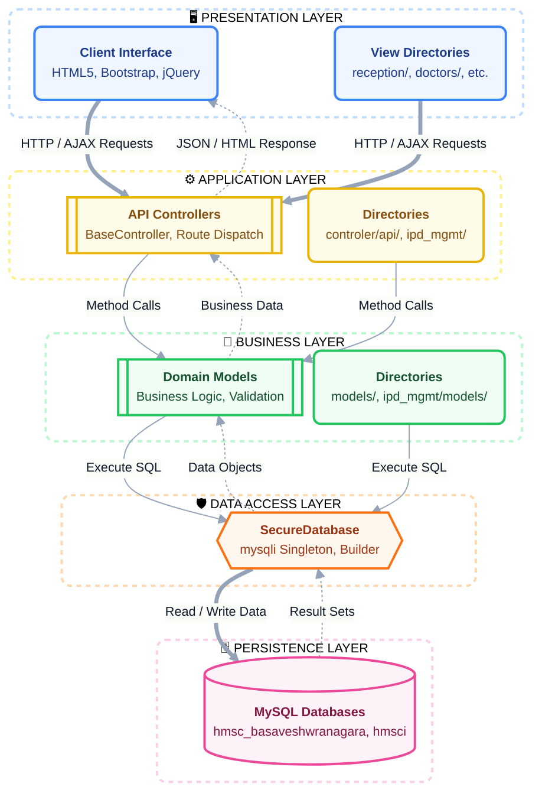

# GM_HMS — System Architecture & Technical Design

---

> **Document Type:** Technical Architecture Reference  
> **Version:** 2.0.0  
> **Audience:** Technical Team · Senior Management  
> **Date:** August 2026

---

## Table of Contents
1. [Architecture Pattern](#1-architecture-pattern)
2. [Request Lifecycle](#2-request-lifecycle)
3. [Core Framework Components](#3-core-framework-components)
4. [Database Layer](#4-database-layer)
5. [Code Execution Flow](#5-code-execution-flow)
6. [API Routing System](#6-api-routing-system)
7. [Session & State Management](#7-session--state-management)
8. [Module Architecture](#8-module-architecture)
9. [JavaScript & AJAX Flow](#9-javascript--ajax-flow)
10. [File Organization Principles](#10-file-organization-principles)

---

## 1. Architecture Pattern

GM_HMS follows a **hybrid MVC (Model-View-Controller)** architecture:



### Design Patterns Used

| Pattern | Where Applied | Purpose |
|---------|--------------|---------|
| **Singleton** | `SecureDatabase` | Single DB connection per request |
| **MVC** | Controllers + Models + Views | Code organization |
| **Repository** | Model classes | Data access abstraction |
| **Strategy** | Route dispatch | HTTP method routing |
| **Template Method** | `BaseController`, `IpdBaseModel` | Common behavior in base, specifics in subclass |
| **Factory** | Controller instantiation | Object creation via class name |

---

## 2. Request Lifecycle

### Page Request (Non-API)

```
User Browser
    │
    │ GET /GM_HMS/reception_view/index.php
    ▼
Apache (.htaccess)
    │ No rewrite needed for direct page
    ▼
PHP Page File (e.g., reception_view/index.php)
    │
    ├─ session_start()
    ├─ Include middleware/auth_check.php
    │     └─ Check $_SESSION['role'] === 'receptionist'
    │         └─ If not → redirect to login.php
    │
    ├─ Require models (PatientModel, etc.)
    ├─ Execute DB queries directly OR via AJAX
    ├─ Render HTML template
    └─ Return complete HTML page to browser
```

### API Request

```
Browser / AJAX
    │
    │ POST /GM_HMS/api/billing/opd
    │ Content-Type: application/json
    │ Body: { "patient_id": "PID-...", ... }
    ▼
Apache (.htaccess in /api/)
    │ RewriteRule → /api/index.php
    ▼
api/index.php (Central Dispatcher)
    │
    ├─ session_start()
    ├─ require_once core/Autoloader.php
    ├─ $router = new Router()
    │
    ├─ Define ALL routes (100+)
    │     $router->add('POST', '#^/api/billing/opd/?$#',
    │         'GM_HMS\Controllers\api\OpdBillingController', 'createBill')
    │
    ├─ $path = parse_url($_SERVER['REQUEST_URI'], PHP_URL_PATH)
    ├─ Strip to /api/billing/opd
    ├─ $route = $router->dispatch($path, 'POST')
    │
    ├─ Instantiate OpdBillingController
    ├─ call_user_func_array([$controller, 'createBill'], $params)
    │
    ├─ Controller → BaseController::__construct()
    │     └─ Auth check, rate limit check
    │
    ├─ Controller reads JSON body
    ├─ Controller calls OpdBillingModel::createBill()
    ├─ Model → SecureDatabase::execute(SQL, params)
    ├─ MySQL returns result
    ├─ Model returns array to Controller
    ├─ Controller calls $this->success($data, 'Bill created')
    └─ JSON response sent: { "success": true, "data": {...} }
```

---

## 3. Core Framework Components

### 3.1 Autoloader (`core/Autoloader.php`)

```
Namespace → Directory Mapping:

GM_HMS\Controllers\api\  → controler/api/
GM_HMS\Models\           → models/
GM_HMS\Database\         → Database/
GM_HMS\Config\           → config/
GM_HMS\Security\         → security/
GM_HMS\Modules\Pharmacy\ → modules/Pharmacy/
GM_HMS\Modules\Lab\      → modules/Laboratory/
GM_HMS\Modules\Payment\  → modules/Payment/
```

PSR-4 standard: `GM_HMS\Controllers\api\PatientController`
→ loads `controler/api/PatientController.php`

### 3.2 Router (`core/Router.php`)

```
Router::add(method, regex_pattern, controller_class, action)
Router::dispatch(path, method)
    → Iterates registered routes
    → Tests regex against path
    → If match: returns ['controller', 'action', 'params']
    → If no match: returns null → 404
```

**Route Pattern Examples:**
```
#^/api/patients/?$#                    → exact match
#^/api/patients/(PID-\d{8}-\d{3})/?$# → capture patient ID
#^/api/doctors/([^/]+)/analytics/?$#  → capture doctor ID
```

### 3.3 BaseController (`controler/BaseController.php`)

All API controllers extend this class. Key capabilities:

| Method | Purpose |
|--------|---------|
| `__construct()` | Session check, rate limiting |
| `restrictMethod(method)` | Enforce HTTP method |
| `getRequestData()` | Parse JSON body or POST data |
| `getParam(key)` | Get query string parameter |
| `getPagination()` | Extract page/limit params |
| `validateInput(data, schema)` | JSON Schema validation |
| `success(data, msg, code)` | Send 200 JSON response |
| `error(msg, code, details)` | Send error JSON response |
| `requireAuth()` | Verify session authentication |

---

## 4. Database Layer

### 4.1 SecureDatabase Singleton

```php
// Usage pattern across all models:
$this->db = SecureDatabase::getInstance();

// Core operations:
$this->db->execute($sql, $params);   // INSERT/UPDATE/DELETE
$this->db->fetchAll($sql, $params);  // SELECT multiple rows
$this->db->fetchOne($sql, $params);  // SELECT single row
$this->db->insert($table, $data);    // Dynamic INSERT builder
$this->db->update($table, $data, $where, $whereParams); // Dynamic UPDATE
$this->db->delete($table, $where, $whereParams);        // DELETE
$this->db->beginTransaction();       // Transaction start
$this->db->commit();                 // Commit
$this->db->rollback();              // Rollback
```

### 4.2 Auto Type Detection

The `execute()` method auto-detects parameter types for `bind_param()`:

```
PHP bool    → 'i' (integer 0/1)
PHP int     → 'i'
PHP float   → 'd'
PHP string  → 's'
PHP null    → 's'
```

### 4.3 Multi-Branch Database Selection

```
HTTP Header: X-Hospital-Branch: basaveshwaranagar
     → DB: hmsc_basaveshwranagara

Session: $_SESSION['branch'] = 'nagarabhavi'
     → DB: hmsci

No branch set:
     → Default DB (from .env DB_NAME)
```

### 4.4 Connection Settings

```sql
SET SQL_MODE='STRICT_ALL_TABLES,NO_ZERO_DATE,NO_ZERO_IN_DATE'
SET time_zone = '+05:30'
CHARSET: utf8mb4
COLLATION: utf8mb4_unicode_ci
```

---

## 5. Code Execution Flow

### Complete Execution Flow — IPD Billing Example

```
Step 1: User Action
    Receptionist clicks "Add Room Rent" in IPD Billing page

Step 2: JavaScript
    jQuery.ajax({
        url: '/GM_HMS/api/ipd-billing-items',
        method: 'POST',
        data: JSON.stringify({
            action: 'generate_room_rent',
            bill_id: 'BILL-20260814-0001',
            from_date: '2026-08-10',
            to_date: '2026-08-14'
        })
    })

Step 3: Apache
    Rewrites to /api/index.php

Step 4: api/index.php
    Router matches: POST /api/ipd-billing-items
    → IpdBillingItemController::handleRequest()

Step 5: IpdBillingItemController::handleRequest()
    Reads action = 'generate_room_rent'
    Calls: IpdBillingItem::generateRoomRent(
        $billId, $admissionId, $patientId, $from, $to, $user
    )

Step 6: IpdBillingItem::generateRoomRent()
    → SecureDatabase::fetchOne(
        "SELECT hb.* FROM ipd_admissions ia
         JOIN hospital_beds hb ON ia.bed_id = hb.sl_no
         WHERE ia.admission_id = ?"
    )
    → Loop from_date to to_date:
        Check duplicate per day
        SecureDatabase::insert('ipd_billing_items', {...})
    → Call IpdBillingMaster::recalculateMaster($billId)

Step 7: IpdBillingMaster::recalculateMaster()
    → catchUpBedCharges() — ensure all days covered
    → SUM items by charge_type
    → Apply discount
    → Sum payments from ipd_payment
    → Apply insurance
    → Calculate balance_due
    → SecureDatabase::update('ipd_billing_master', {...})
    → Returns updated financial summary

Step 8: Controller returns JSON
    { "success": true, "added": 5, "financial": { "grand_total": 12500, ... } }

Step 9: JavaScript receives response
    Updates billing summary panel on UI
    Shows success notification (SweetAlert2)
```

---

## 6. API Routing System

### Route Registration Pattern

```php
$router->add(
    'POST',                                    // HTTP Method
    '#^/api/billing/opd/?$#',                 // Regex pattern
    'GM_HMS\Controllers\api\OpdBillingController', // Controller class
    'createBill'                              // Method name
);
```

### Route Dispatch Algorithm

```
1. Extract path from REQUEST_URI
2. Strip query string
3. Find /api/ position in path
4. Iterate through registered routes
5. For each route:
   a. Check HTTP method matches
   b. Test regex against path
   c. If match: extract capture groups as $params
   d. Return {controller, action, params}
6. If no match: return null
```

### Closure Routes

Some routes use inline closures for simple operations:

```php
$router->add('GET', '#^/api/hospital-beds/?$#', function() {
    $db = SecureDatabase::getInstance();
    $beds = $db->fetchAll("SELECT hb.*, p.* FROM hospital_beds hb LEFT JOIN patient p ...");
    echo json_encode(['success' => true, 'data' => $beds]);
}, null);
```

---

## 7. Session & State Management

### Session Variables

| Variable | Type | Set By | Used By |
|----------|------|--------|---------|
| `$_SESSION['user_id']` | int | Login | All controllers |
| `$_SESSION['role']` | string | Login | Role guards |
| `$_SESSION['staff_id']` | int | Login | Staff operations |
| `$_SESSION['doctor_id']` | string | Login (doctors) | Doctor operations |
| `$_SESSION['username']` | string | Login | Display |
| `$_SESSION['full_name']` | string | Login | Display |
| `$_SESSION['hospital_branch']` | string | Login | DB selection |

### Session Security

```
1. session_start() on every page
2. Login: session_regenerate_id(true) — prevent fixation
3. Middleware: check session role matches expected role
4. Logout: session_destroy() + cookie deletion
5. Session timeout: configured in PHP ini
```

---

## 8. Module Architecture

### Standalone Modules (`modules/`)

Each module follows a self-contained MVC structure:

```
modules/Pharmacy/
├── Controllers/
│   ├── BillingController.php
│   ├── DashboardController.php
│   ├── IPOrdersController.php
│   ├── ProductController.php
│   ├── ReportController.php
│   ├── SalesController.php
│   └── SettingsController.php
├── Models/
│   └── (domain models)
└── Views/
    └── (if applicable)

modules/Laboratory/
└── Controllers/
    └── LaboratoryController.php (handles all lab operations)

modules/Payment/
└── Controllers/
    └── PaymentController.php
```

### IPD Management Sub-Application

`reception_view/ipd_management/` is a **self-contained MVC app** within the main app:

```
ipd_management/
├── core/
│   ├── BaseController.php    ← Local controller base
│   ├── BaseModel.php         ← Local model base
│   └── Database.php          ← Local DB connection
├── controllers/              ← 13 domain controllers
├── models/                   ← 15 domain models
├── views/                    ← 8 view sections
├── routes/api.php            ← Local route definitions
└── public/
    ├── index.php             ← Single entry point (SPA)
    └── api.php               ← API gateway
```

---

## 9. JavaScript & AJAX Flow

### Standard AJAX Pattern

```javascript
// Standard pattern across all pages:
$.ajax({
    url: '/GM_HMS/api/endpoint',
    method: 'POST',
    contentType: 'application/json',
    data: JSON.stringify(payload),
    success: function(response) {
        if (response.success) {
            // Update UI
            Swal.fire('Success', response.message, 'success');
        } else {
            Swal.fire('Error', response.error, 'error');
        }
    },
    error: function(xhr) {
        Swal.fire('Error', 'Server error: ' + xhr.status, 'error');
    }
});
```

### DataTables Integration

```javascript
// Used for all list/grid displays:
$('#tableId').DataTable({
    ajax: {
        url: '/GM_HMS/api/patients',
        dataSrc: 'data'
    },
    columns: [...],
    pageLength: 25,
    order: [[0, 'desc']]
});
```

### Select2 Integration

```javascript
// Used for patient/doctor/medicine search dropdowns:
$('#patientSelect').select2({
    ajax: {
        url: '/GM_HMS/reception_view/api/search_appointment_patient.php',
        processResults: function(data) {
            return { results: data.map(p => ({ id: p.patient_id, text: p.patient_name })) };
        }
    }
});
```

---

## 10. File Organization Principles

### Naming Conventions

| Type | Convention | Example |
|------|-----------|---------|
| Controller files | PascalCase + Controller | `PatientController.php` |
| Model files | PascalCase + Model | `PatientModel.php` |
| View files | snake_case | `patient_registration.php` |
| API helper files | snake_case | `search_ipd_patient.php` |
| CSS/JS | kebab-case | `ipd-billing.js` |

### Namespace Structure

```
GM_HMS\Controllers\api\   → API controllers
GM_HMS\Models\            → Shared models
GM_HMS\Database\          → Database layer
GM_HMS\Config\            → Configuration
GM_HMS\Security\          → Auth & encryption
GM_HMS\Modules\Pharmacy\  → Pharmacy module
GM_HMS\Modules\Laboratory\→ Lab module
```

### Code Quality Notes

| Aspect | Status |
|--------|--------|
| Prepared Statements | ✅ 100% — via SecureDatabase |
| Error Logging | ✅ — to api_errors.log, never displayed |
| Input Validation | ✅ — BaseController::validateInput() |
| Output Encoding | ✅ — htmlspecialchars where applicable |
| Transaction Support | ✅ — beginTransaction/commit/rollback |
| DRY Principle | ⚠️ Partial — some duplicate model sets |
| Unit Tests | ❌ Not yet implemented |

---

*End of Document — GM_HMS System Architecture*

---
**Document Control**  
| Version | Date | Changes |
|---------|------|---------|
| 2.0 | Aug 2026 | Complete architecture documentation |
