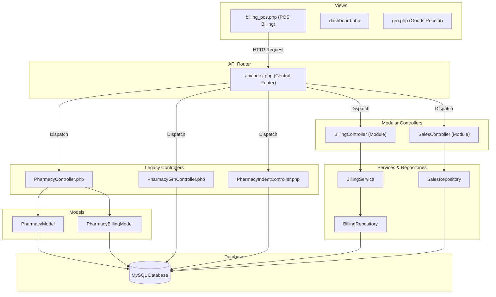

# Pharmacy System Architecture & API Reference

This document provides a detailed breakdown of the **Pharmacy Module** in the Hospital Management System (GM_HMS). The system utilizes a hybrid model: a standard MVC controller-model structure alongside a domain-driven Modular layer under the `modules/Pharmacy/` namespace.

---

## 📂 Pharmacy Component Map



---

## 💾 Database Schema

The pharmacy module operates across several inter-related tables:

1. **`ph_product`**: Contains product details. Each batch is stored as a separate unique record (`product_id` format `PRD-XXXXXX`) to enforce price/expiry isolation.
   - Core fields: `product_id`, `product_name`, `strength`, `form`, `hsn_code`, `manufacturer`, `purchase_rate`, `mrp`, `tax_percent`, `quantity`, `batch_number`, `expiry_date`.
2. **`ph_product_batches`**: Keeps stock allocations separated strictly by batch numbers.
   - Core fields: `id`, `product_id`, `batch_number`, `expiry_date`, `quantity`.
3. **`ph_sales_master`**: Sales invoice registry.
   - Core fields: `invoice_no` (`INV-XXXXX`), `invoice_date`, `invoice_time`, `customer_id`, `customer_name`, `customer_phone`, `subtotal`, `discount_amount`, `tax_total`, `grand_total`, `paid_amount`, `balance`, `payment_method`, `status`.
4. **`ph_sales_items`**: Line items sold per invoice.
   - Core fields: `id`, `invoice_no`, `paient_id`, `product_id`, `product_name`, `batch_no`, `qty`, `rate`, `discount_percent`, `tax_percent`, `tax_amount`, `total`.
5. **`ph_stock_receive`**: Log of received goods (GRNs).
   - Core fields: `id`, `receive_no` (`GRN-XXXXX`), `receive_date`, `po_no`, `supplier_id`, `supplier_name`, `invoice_no`, `product_id`, `item_name`, `batch_no`, `expiry_date`, `received_qty`, `damaged_qty`, `net_qty`, `rate`, `status` (0: Draft, 1: Submitted).
6. **`ph_indent_requests`**: Procurement indents for replenishing stock.
   - Core fields: `id`, `indent_no` (`IND-XXXXX`), `request_date`, `requested_by`, `department`, `product_id`, `item_name`, `qty`, `priority`, `status` (`pending`, `approved`, `ordered`, `cancelled`).

---

## ⚙️ Core Logic & Business Rules

### 1. FIFO (First-In, First-Out) Batch Deductions
When a POS invoice is saved in [BillingRepository.php](file:///d:/xampp/htdocs/GM_HMS/modules/Pharmacy/Repositories/BillingRepository.php#L193-L212), stock is deducted from the master item row, and individual batches are decremented chronologically:
- Query `ph_product_batches` for the given `product_id` where `quantity > 0`.
- Sort by `expiry_date` ascending (`COALESCE(expiry_date, '2099-12-31') ASC`).
- Loop through the batches, deducting the required quantity from the earliest batch first until the checkout count is satisfied.

```php
// FIFO Batch Deduction snippet from BillingRepository.php
$qtyToDeduct = (int)$item['qty'];
$batches = $this->db->fetchAll(
    "SELECT id, quantity FROM ph_product_batches 
     WHERE product_id = ? AND quantity > 0 
     ORDER BY COALESCE(expiry_date, '2099-12-31') ASC",
    [$item['product_id']]
);

foreach ($batches as $batch) {
    if ($qtyToDeduct <= 0) break;
    $batchQty = (int)$batch['quantity'];
    $deduct = min($qtyToDeduct, $batchQty);
    
    $this->db->execute(
        "UPDATE ph_product_batches SET quantity = quantity - ? WHERE id = ?",
        [$deduct, $batch['id']]
    );
    $qtyToDeduct -= $deduct;
}
```

### 2. Batch Isolation during GRN Submission
In [PharmacyGrnController.php](file:///d:/xampp/htdocs/GM_HMS/controler/api/PharmacyGrnController.php#L180-L276), submitting a Goods Receipt Note (`bulkSubmit`) handles batch segregation:
- If a product with the same `product_id` and `batch_number` already exists, it updates the stock quantity, expiry, and purchase rate.
- If it's a **new batch** for an existing product:
  1. Generates a new unique `product_id` (e.g. `PRD-XXXXXX`).
  2. Copies metadata (product name, composition, HSN, form, unit, tax rate) from the template of the base product.
  3. Inserts a separate record into `ph_product` with the new quantity, purchase rate, batch number, and expiry date.
  4. Links the GRN line item (`ph_stock_receive`) to the new unique `product_id`.
- This ensures batch integrity, preventing prices and expiry dates of different batches from overwriting each other.

---

## 🛠 Controller & Service Breakdowns

### 1. Legacy Integration API: `PharmacyController`
Located in [PharmacyController.php](file:///d:/xampp/htdocs/GM_HMS/controler/api/PharmacyController.php). 
- **`getDashboardSummary()`**: Returns overall statistics (active inventory count, out-of-stock items, warnings) along with brief lists of expiring and low-stock products.
- **`getLowStockAlerts()`** & **`getExpiryAlerts()`**: Returns lists of products sorted by threshold violations and impending expiry respectively.
- **`getPatientPrescription()`**: Returns patient info plus consultation records containing SOAP prescription plan medicines.
- **`createBill()`**: Legacy POS billing handler. Recalculates totals on the server-side, checks stock availability, deducts inventory, assigns invoice numbers, commits transactions, and generates HTML invoice pages.

### 2. Modular POS API: `BillingController` & `BillingService`
Located in [BillingController.php](file:///d:/xampp/htdocs/GM_HMS/modules/Pharmacy/Controllers/BillingController.php) and [BillingService.php](file:///d:/xampp/htdocs/GM_HMS/modules/Pharmacy/Services/BillingService.php).
- Refactored version separating business workflows (`BillingService`) from database access (`BillingRepository`) and UI rendering (`InvoiceRenderer`).
- **`checkout()`**:
  1. Validates inputs using `BillingCreateRequest::validate()`.
  2. Server-side totals verification (gross subtotal, line-level discount percentage, CGST/SGST tax amount, final grand total, and payment balance).
  3. Calls `BillingRepository::saveSale()` to execute master and line-item insertions, inventory deductions, and FIFO batch deductions.
  4. Calls `InvoiceRenderer::render()` to return pre-formatted print-ready HTML for the thermal/laser invoice printer.

### 3. procurement & Indent API: `PharmacyIndentController`
Located in [PharmacyIndentController.php](file:///d:/xampp/htdocs/GM_HMS/controler/api/PharmacyIndentController.php).
- **`autoGenerate()`**: Fetches `low_stock_threshold` from settings (default `20`). Selects products where quantity is below threshold and no active (pending/approved) indent exists. Creates automatic draft indents (`IND-XXXXX`) to replenish stock to a default level (minimum `10` or enough to reach `50` units).
- **`bulkStatus()`** & **`bulkDelete()`**: Allows pharmacists to batch-approve, cancel, or remove indents.

---

## 🖥 Frontend POS Workflow

Located in [billing_pos.php](file:///d:/xampp/htdocs/GM_HMS/pharmacy_view/billing_pos.php).

### 1. Patient Selection & Suggestions
- The user inputs an ID, name, or phone number in `#patientSearch`.
- Typing triggers an auto-complete request to `/api/pharmacy/billing/patients?q=`.
- Once selected, the patient card displays vitals and triggers `loadPrescriptionSuggestions()`.
- The system queries `/api/pharmacy/billing/prescriptions?patient_id=`. If a doctor has logged SOAP plan medicines in the patient's latest consultation, the POS automatically fetches matches from the active inventory and populates the cart items, drastically reducing human entry time.

### 2. Dynamic Cart & GST Math
- Active items can be scanned via barcode or searched by typing in `#productSearch`.
- Each product added to the cart triggers `recalc()` which computes:
  - Line gross: $\text{Quantity} \times \text{Rate}$
  - Line discount: $\text{Gross} \times \frac{\text{Discount \%}}{100}$
  - Taxable value: $\text{Gross} - \text{Line Discount}$
  - CGST (Central GST) and SGST (State GST): Each allocated at exactly $50\%$ of the product's tax rate (e.g. $6\%$ each for a $12\%$ GST medicine).
- Checks are made against the batch maximum quantity (`max_qty`) on each modification.
- Submission payload:
```json
{
  "customer_id": "PID-20260520-001",
  "customer_name": "John Doe",
  "customer_phone": "9876543210",
  "payment_method": "upi",
  "paid_amount": 250.00,
  "discount_amount": 10.00,
  "cart": [
    {
      "product_id": "PRD-521943",
      "product_name": "Dolo 650",
      "batch_no": "B1204",
      "qty": 2,
      "rate": 15.00,
      "discount_percent": 0,
      "tax_percent": 12.00
    }
  ]
}
```
- On success, it opens a popup printing window with the pre-compiled `invoice_html` containing structured tables, business headers, GST splits, and values converted to word strings.

---

## 📊 Summary of Active Endpoints

| Method | Endpoint | Controller Action | Purpose |
| :--- | :--- | :--- | :--- |
| **GET** | `/api/pharmacy/dashboard-summary` | `PharmacyController@getDashboardSummary` | Fetch quick stats & alert lists for dashboard |
| **GET** | `/api/pharmacy/low-stock-alerts` | `PharmacyController@getLowStockAlerts` | Get sorted list of low stock items |
| **GET** | `/api/pharmacy/expiry-alerts` | `PharmacyController@getExpiryAlerts` | Get sorted list of expiring items |
| **GET** | `/api/pharmacy/patient-prescription` | `PharmacyController@getPatientPrescription` | Retrieve patient info & consultations |
| **GET** | `/api/pharmacy/billing/patients` | `BillingController@searchPatients` | Search patients for checkout context |
| **GET** | `/api/pharmacy/billing/products` | `BillingController@searchProducts` | Query in-stock product list |
| **GET** | `/api/pharmacy/billing/prescriptions` | `BillingController@getPrescriptions` | Load doctor prescription templates for cart |
| **POST** | `/api/pharmacy/billing/checkout` | `BillingController@checkout` | Process sale, deduct FIFO stock, return invoice |
| **GET** | `/api/pharmacy/billing/print` | `BillingController@printInvoice` | Reprint invoice HTML template |
| **POST** | `/api/pharmacy/grn/bulk-submit` | `PharmacyGrnController@bulkSubmit` | Submit draft GRNs and isolate new batches |
| **POST** | `/api/pharmacy/indents/auto-generate` | `PharmacyIndentController@autoGenerate` | Auto-draft low stock procurement requests |
